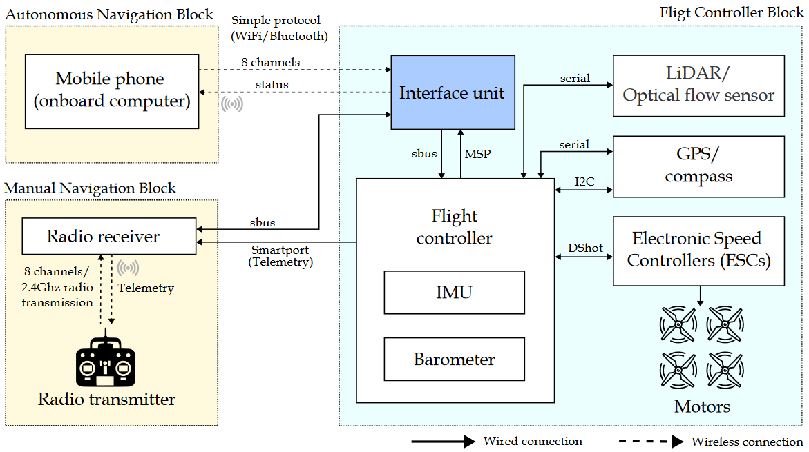
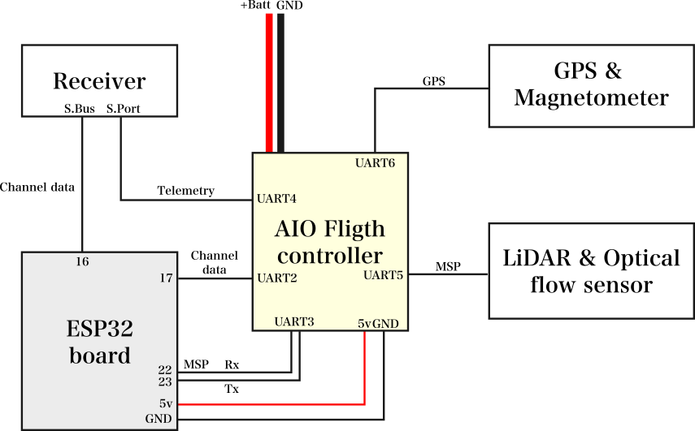

# Smartdrones
Smartdrone is an innovative UAV platform that redefines drone capabilities in educational and research settings by integrating a smartphone as the onboard computer for the drone's self-guided navigation. This approach enhances the drone's functionality not only by utilizing advanced cameras and sensors present on modern smartphones but also by taking advantage of the vast programming libraries and communication protocols available for smartphones. 

## Main features
* **Affordable:** Our design emphasizes cost-effectiveness, utilizing affordable, readily available electronic components and hardware. 
* **Open:** The platform is open and free to use. It utilizes open-source hardware and firmware. 
* **Extensible:** It is easy to integrate with various types of smartphones and sensors, ensuring adaptability to future requirements and advancements.

## Smartdrone´s architecture
Our system has three key parts: 1) The Autonomous Navigation Block (ANB) for self-flying, 2) The Manual Navigation Block (MNB) for flying it by hand using a radio, and 3) The Flight Controller Block (FCB) which manages the drone's flying mechanisms. The FCB uses sensor data to control the motors. The ANB makes the drone fly on its own using a smartphone's sensors and apps. The MNB lets a person take manual control takeover through a radio transmitter.

## Getting started
### Build the drone
Choose the right frame for your project. Each frame comes with recommended components, but keep in mind that not all suggested parts might be available or exactly the same. The key is to ensure that the components you select serve the same purpose or function. The folder with available frames is located in [/frames](). This folder contains the files for cutting the parts in carbon fiber and 3D parts that should be printed in TPU (or similar flexible filament) and PETG (or similar filament). It also provides the pins used for soldering the connections. Below is an overview of the pin connections of all the components.

### Configure the drone
After installing iNAV on the flight controller, it needs to be set up correctly. The setup can vary based on the components and ports (pins) chosen on the flight controller. You'll find a document named setup.docx in the frame's folder, which explains the flight controller's configuration in detail. Below, we provide an overview of the general configuration process.

### Test the drone
After setting up the drone, the next step is to conduct a test flight. This helps check if all components are correctly installed and configured and if the drone flies well. While the configuration document includes recommended PID settings, keep in mind these values vary for each drone. If the drone vibrates too much or is unstable during flight, you can adjust its performance by modifying the PID values. For guidance on how to do this, check out the video playlist at: [iNAV configuration guide](https://www.youtube.com/playlist?list=PLOUQ8o2_nCLloACrA6f1_daCjhqY2x0fB)

