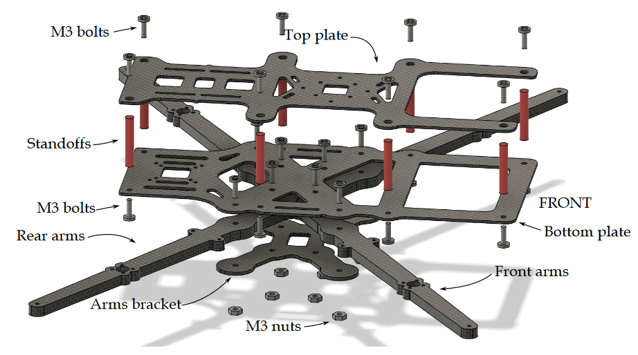
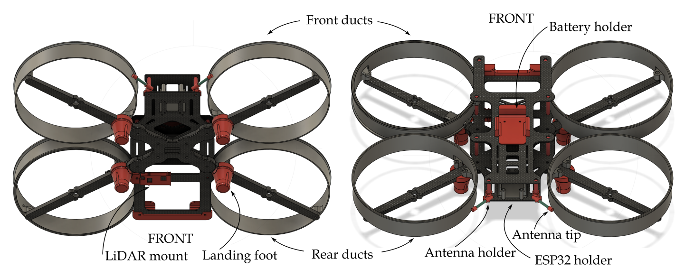

# Base frame (5-6 inches)
This frame is designed to carry out smartphones with screen sizes up to 6.5 inches. When assembled with the suggested components and powered by a 2000 mAh 4S battery, the drone is able to achieve a flight duration ranging from 10 to 15 minutes.

## Components
This is the list of recommended components. 
- [GOKU HD 745 EVO 40A AIO](https://flywoo.net/products/goku-hd745-evo-40a-aio-bl_32-dji-plus-play)
- [iFlight M8Q-5883-GPS Module V2.0](https://newbeedrone.com/products/iflight-m8q-5883-gps-and-compass-v2-0)
- [Matek 3901-L0X](http://www.mateksys.com/?portfolio=3901-l0x)
- [FrSky R-XSR](https://www.frsky-rc.com/product/r-xsr/)
- [T-Motor F2203.5 - 1500KV](https://store.tmotor.com/product/f2203_5-fpv-motor.html) 
- [ESP32 Development Board](https://www.espressif.com/en/products/devkits/esp32-devkitc)
- [Gemfan F6030](https://www.getfpv.com/gemfan-floppy-proppy-f6030-3-blade-propeller-set-of-4.html)

## Assembly the frame
The drone construction is based on a carbon fiber Frame, which is fastened using screws, secure nuts, and aluminum standoffs. The design files for each carbon fiber part can be found in the [frame](frame) folder, provided in DXF format for precision manufacturing. Below is a detailed breakdown of the parts that constitute the frame, including the thickness of each carbon fiber component:
* Top Plate: 1.5mm thick
* Bottom Plate: 2mm thick
* Front Arm: 6mm thick
* Rear Arm: 6mm thick
* Arm Holder: 2mm thick
* Aluminum Standoffs: 25mm in length
* M3 Bolts and Nuts: 12mm in size

An illustrative guide detailing the assembly of the frame is provided in the image below. 

## 3D printed parts
The drone frame includes parts that need to be printed using a 3D printer. The files for these specific parts are in the [3dparts](3dparts) folder. Below, we provide a detailed list of the components to be printed, along with the recommended type of filament for each. 
* [Front bumper](3dparts/tpu-front_bumper.stl) (TPU-95-98A) 
* [Landing foot](3dparts/tpu-landing_foot.stl) (TPU-95-98A)
* [Battery holder](3dparts/tpu-battery_holder.stl) (TPU-95-98A)
* [LiDAR mount](3dparts/tpu-lidar_mount.stl) (TPU-95-98A)
* [Antenna holder (left)](3dparts/tpu-antenna_holder_left.stl) (TPU-95-98A)
* [Antenna holder (right)](3dparts/tpu-antenna_holder_right.stl) (TPU-95-98A)
* [Antenna tip](3dparts/tpu-antenna_tip.stl) (TPU-95-98A)
* [ESP32 holder](3dparts/petg-esp32_holder.stl) (PETG)
* [Flight controller protector](3dparts/petg-fc_protector.stl) (PETG)
* [Front duct (left)](3dparts/petg-duct_front_left.stl) (PETG)
* [Front duct (right)](3dparts/petg-duct_front_right.stl) (PETG)
* [Rear duct (left)](3dparts/petg-duct_rear_left.stl) (PETG)
* [Rear duct (left)](3dparts/petg-duct_rear_right.stl) (PETG)

The location of the 3D printed parts are shown in the following image: 

In addition to the parts already mentioned, your drone build will require some additional components and hardware not previously listed. These include 20mm M2 screws and nuts, which are used for securing the ducts. You will also need battery straps to ensure both the smartphone and the battery are firmly held in place. 